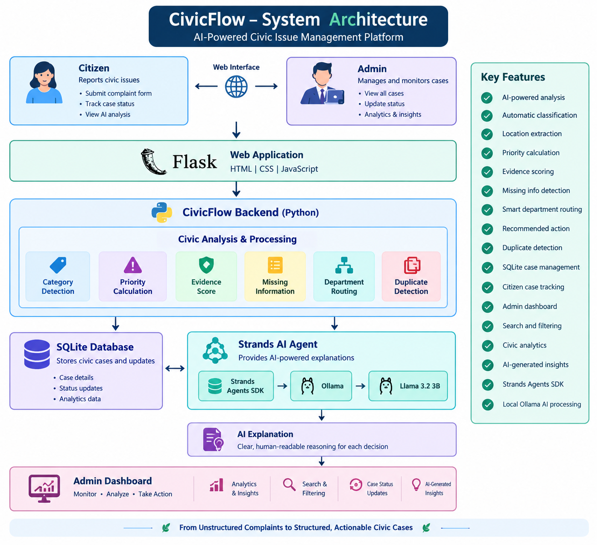

# CivicFlow – AI Community Action Platform

CivicFlow is an AI-powered civic issue management platform that helps citizens report local problems and helps administrators analyze, prioritize, route, and track those complaints.

It combines structured civic analysis with the **Strands Agents SDK** and a local **Ollama AI model** to generate clear explanations for each decision.

## 🏗️ System Architecture



---

## 🚀 Problem

Civic complaints such as:

- Broken streetlights
- Road damage and potholes
- Garbage collection problems
- Water leakage
- Infrastructure issues

are often reported without enough structure.

This can make it difficult to determine:

- What type of issue it is
- How urgent it is
- Which department should handle it
- What information is missing
- Whether a similar complaint already exists
- What action should be taken

CivicFlow converts an unstructured complaint into a structured, actionable civic case.

---

## 💡 Solution

CivicFlow provides two main experiences.

### 👤 Citizen Side

A citizen can submit a complaint using a simple form.

CivicFlow analyzes the complaint and generates:

- Case ID
- Issue category
- Location
- Priority
- Evidence score
- AI confidence
- Missing information
- Recommended department
- Recommended action
- Suggested response time
- Possible duplicate complaints
- AI explanation

### 🏢 Admin Side

Administrators can monitor reported cases through a dashboard.

The dashboard provides:

- Total cases
- Open cases
- Urgent cases
- Resolved cases
- Search
- Category filters
- Priority filters
- Status filters
- Category analytics
- Status analytics
- Priority analytics
- AI-generated civic insights
- Case status updates

---

# 🤖 Strands AI Integration

CivicFlow uses the **Strands Agents SDK** to provide AI-powered explanations of civic analysis.

The current local AI workflow is:

```text
Strands Agents SDK
        ↓
Ollama
        ↓
Llama 3.2 3B